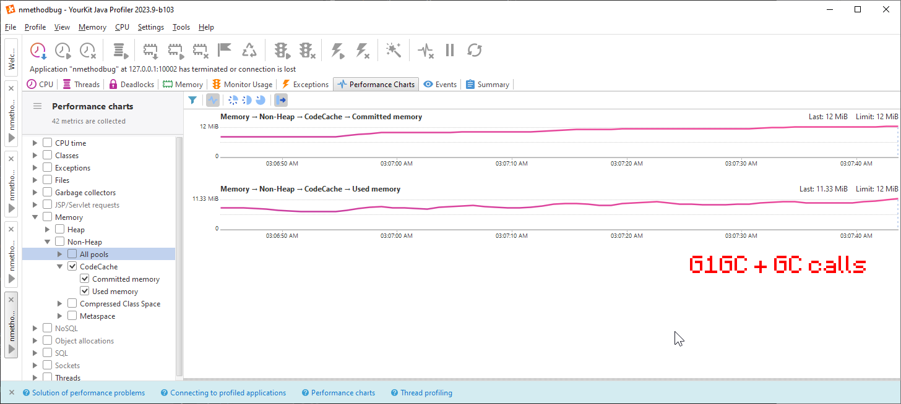
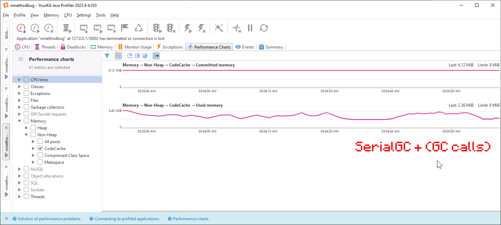
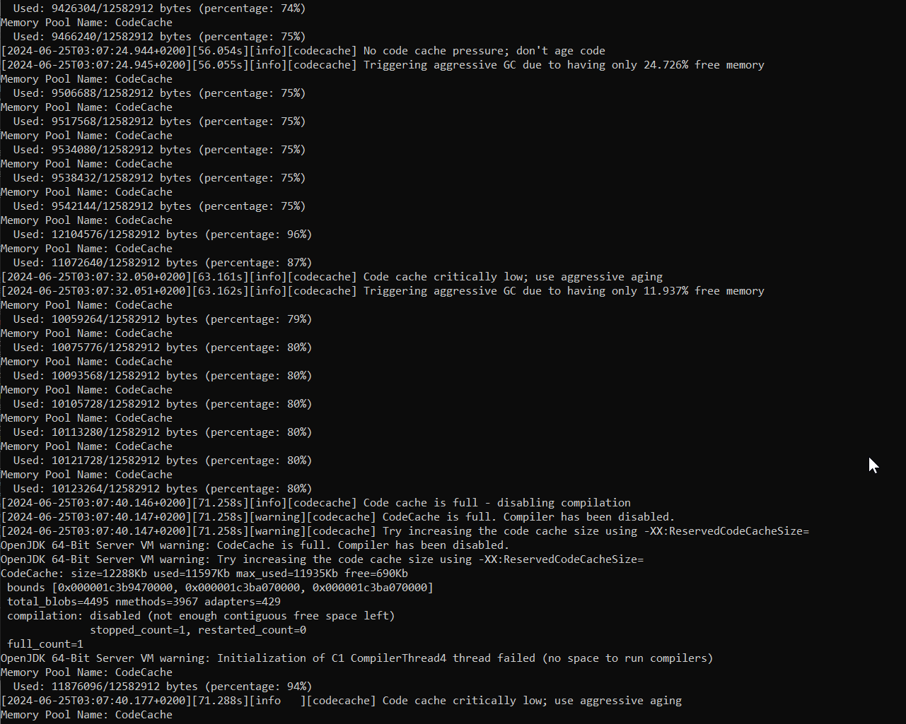

# G1GC CodeCache Cleanup Issue (JBR DCEVM Bug?)

This repository demonstrates an issue where G1GC does not correctly clean up the JVM CodeCache, even in emergency situations. Very likely caused by Caused by JBR-6419 (https://github.com/JetBrains/JetBrainsRuntime/commit/b128bb4b21781f705b5a1ba3b18c468ad806fabf)
As with that change ClassUnloadingWithConcurrentMark is always false if hotswapping is enabled and thus G1GC will **never** call Class Unloading

**arguments.cpp**
```
[...]
setup_hotswap_agent();
if (AllowEnhancedClassRedefinition) {
    ClassUnloading = false;
    ClassUnloadingWithConcurrentMark = false;
}
[...]
void Arguments::setup_hotswap_agent() {
[...]
  // Force AllowEnhancedClassRedefinition if HA is enabled
  AllowEnhancedClassRedefinition = true;
[...]
```


This can be validated with debug-logs for the GC turned on. And this line never showing up:

**g1ConcurrentMark.cpp**
```
  [...]
  // Unload Klasses, String, Code Cache, etc.
  if (ClassUnloadingWithConcurrentMark) {
    GCTraceTime(Debug, gc, phases) debug("Class Unloading", _gc_timer_cm);
  [...]
```

## Initial Example
- The bug **is** happening on on `jbrsdk-21.0.3-windows-x64-b446.1`.
- The bug **is NOT** happening on `jbrsdk-21.0.2-windows-x64-b346.3.tar`.

## JVM Flags used
Running G1GC with low codecache size and only one thread to make debug-logs cleaner. Limit memory to force earlier cleanups
```plaintext
-XX:+UseG1GC 
-XX:HotswapAgent=core
-XX:-AllowEnhancedClassRedefinition
-agentlib:jdwp=transport=dt_socket,server=y,suspend=n,address=127.0.0.1:31337 
-Xmx512M
-XX:ReservedCodeCacheSize=12m 
-XX:ParallelGCThreads=1 
-XX:ConcGCThreads=1
-XX:-SegmentedCodeCache 
```

Debug logs & more agressive sweeping
```plaintext
-XX:StartAggressiveSweepingAt=30
-Xlog:gc*,gc+phases=debug 
-Xlog:codecache*=info:stdout:tags,uptime,time,level 
```

Additonal flags for Hotswap-Agent 1.4.2, top be working with Java21 (https://github.com/HotswapProjects/HotswapAgent/commit/93ca7bb48ba9793cd542d29e156e11087e384f02)
```plaintext
-Dblank 
--add-opens java.base/java.lang=ALL-UNNAMED 
--add-opens java.base/jdk.internal.loader=ALL-UNNAMED 
--add-opens java.base/java.io=ALL-UNNAMED 
--add-opens java.desktop/java.beans=ALL-UNNAMED 
--add-opens java.desktop/com.sun.beans=ALL-UNNAMED 
--add-opens java.desktop/com.sun.beans.introspect=ALL-UNNAMED 
--add-opens java.desktop/com.sun.beans.util=ALL-UNNAMED 
--add-opens java.base/sun.security.action=ALL-UNNAMED 
--add-opens java.base/java.lang.reflect=ALL-UNNAMED
```

## Reproduction Steps

1. **Add Hotswap Agent Core**
   - Ensure a working version of `hotswap-agent-core` is added and fix the Maven import. Use version `1.4.2` to avoid warning messages present in `1.4.1`.

2. **Run the Script**
   - Update `debugG1Failing.bat` or `debugSerialWorking.bat` on Windows, to include the path to a jbrsdk that supports hotswapping and has the hotswap-agent enabled
   - Execute `debugG1Failing.bat` or `debugSerialWorking.bat` on Windows, or similar `.sh` scripts on Unix.

3. **Connect to the Process**
   - Connect to the running process on `127.0.0.1:31337`. If running remotely, forward the local port to the remote machine using your SSH connection with `-L 31337:localhost:31337`.

4. **Profiling Tool**
   - Connect a profiling tool, such as YourKit, to the process.

5. **Trigger the Issue**
   - Start adding spaces to `Main.java` and saving it repeatedly (5-15 times) to crash the code cache on G1GC.

## Workaround

By using `-XX:+UseSerialGC` in combination with calling `System.gc()` every time a code change is detected, it is possible to prevent the CodeCache from crashing. Note that this workaround does NOT work with G1GC.

## Example error
```plaintext
[2024-06-25T03:07:40.146+0200][71.258s][info][codecache] Code cache is full - disabling compilation
[2024-06-25T03:07:40.147+0200][71.258s][warning][codecache] CodeCache is full. Compiler has been disabled.
[2024-06-25T03:07:40.147+0200][71.258s][warning][codecache] Try increasing the code cache size using -XX:ReservedCodeCacheSize=
OpenJDK 64-Bit Server VM warning: CodeCache is full. Compiler has been disabled.
OpenJDK 64-Bit Server VM warning: Try increasing the code cache size using -XX:ReservedCodeCacheSize=
CodeCache: size=12288Kb used=11597Kb max_used=11935Kb free=690Kb
 bounds [0x000001c3b9470000, 0x000001c3ba070000, 0x000001c3ba070000]
 total_blobs=4495 nmethods=3967 adapters=429
 compilation: disabled (not enough contiguous free space left)
              stopped_count=1, restarted_count=0
 full_count=1
OpenJDK 64-Bit Server VM warning: Initialization of C1 CompilerThread4 thread failed (no space to run compilers)
```

## Yourkit CodeCache inspection

**G1GC unable to work with 12MB Code Cache with frequent calls to System.gc()**


**SerialGC able to work with 8MB Code Cache with frequent calls to System.gc()**


**Console log of emergency codecache messages and failure caused by hotswapping the same file again**

